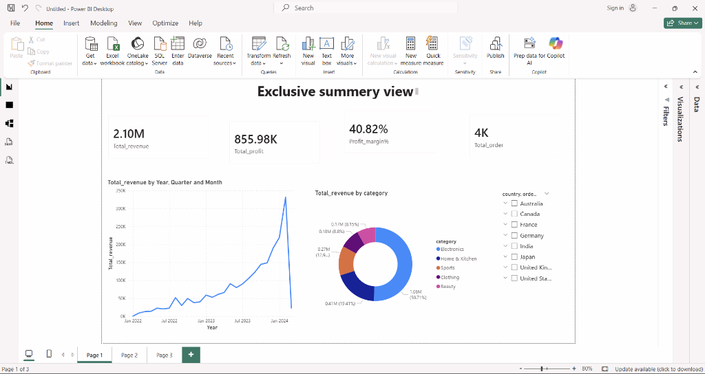
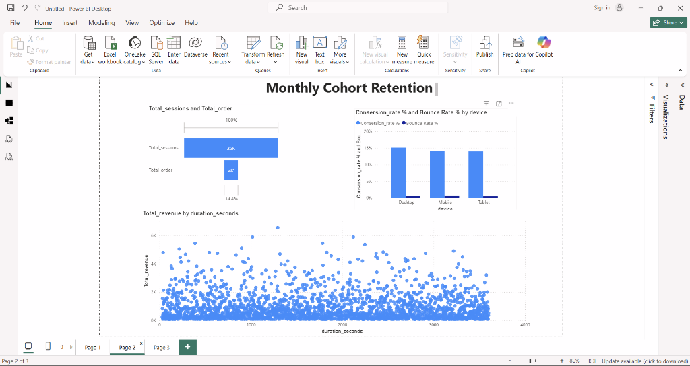

# 📊 Power BI Dashboard Analysis

This document provides a detailed breakdown of the 3-page interactive dashboard built for the E-Commerce Sales & Retention Analytics project.

---

## 🏗️ Data Model (Star Schema)
Before building the visuals, a robust **Star Schema** was established in Power BI:
- **Fact Table**: `orders` (connected to `order_items` and `returns`)
- **Dimension Tables**: `users`, `products`, `sessions`
- **Relationships**: 1-to-Many relationships established via `UserID`, `ProductID`, and `SessionID`.
- **Advanced Modeling**: A dedicated `Date` hierarchy was created to support Time Intelligence functions.

---

## 📈 Page 1: Exclusive Summary View (Executive Overview)
This page serves as the high-level operational command center for business leaders.



### Key Metrics Tracked:
- **Total Revenue**: $2.10M
- **Total Profit**: $855.98K
- **Profit Margin %**: 40.82%
- **Total Orders**: 4K

### Visual Breakdown:
- **Line Chart**: Tracks revenue across Year, Quarter, and Month to identify seasonal growth patterns.
- **Donut Chart**: Segments revenue by product category (Electronics, Home & Kitchen, Sports, etc.).
- **Map/Slicer**: Geographic filtering by country to analyze regional performance.

---

## 🔄 Page 2: Monthly Cohort Retention & Conversion
This page focuses on customer loyalty and funnel efficiency, which are critical for long-term sustainability.



### Key Analytical Pillars:
- **Monthly Cohort Retention**: A deep dive into how many users stay active after their first purchase.
- **Funnel Analysis**: Tracking `Total_sessions` (25K) vs. `Total_orders` (4K) to calculate a **14.4% Conversion Rate**.
- **Funnel Attrition**: Identifying the drop-off point between user browsing and final checkout.

### Technical Deep Dive: DAX Logic
To calculate the true performance of the funnel, I developed the following standard measures:

**1. Conversion Rate %**
```dax
Conversion Rate = 
DIVIDE(
    DISTINCTCOUNT(orders[order_id]), 
    DISTINCTCOUNT(sessions[session_id]), 
    0
)
```

**2. Retained Customers (Page 2)**
```dax
Retained Users = 
VAR CurrentCohort = SELECTEDVALUE(Date[Month])
RETURN 
CALCULATE(
    DISTINCTCOUNT(orders[user_id]),
    FILTER(ALL(orders), [FirstPurchaseMonth] = CurrentCohort)
)
```

### Visual Breakdown:
- **Funnel Visual**: Visualizes the conversion pipeline from session → cart → order.
- **Bar Chart**: Compares Conversion Rate % and Bounce Rate % across different device types (Desktop, Mobile, Tablet).
- **Scatter Plot**: Analyzes revenue distribution by `duration_seconds` to identify "Power Users".

---

## 💡 How to Use
1. **Filter by Region**: Use the country slicer on Page 1 to see how conversion rates vary by market.
2. **Drill Down**: Click on a specific product category to see its specific return rate and retention impact.
3. **Cross-Filtering**: Select a specific month in the Cohort table to see the corresponding sales trend during that period.

---
[⬅️ Back to README](README.md)
